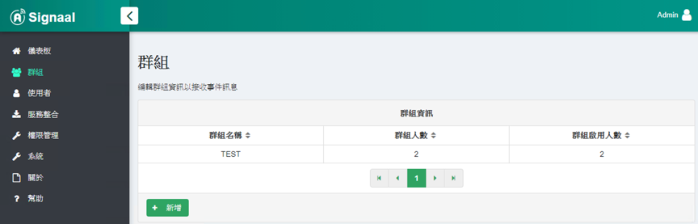
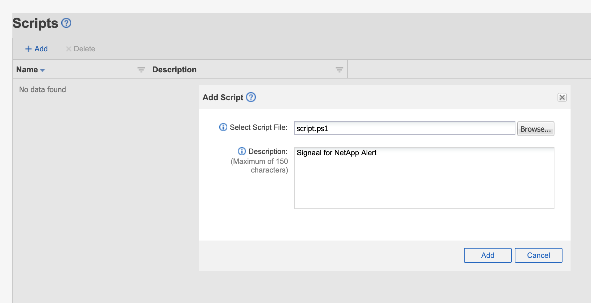
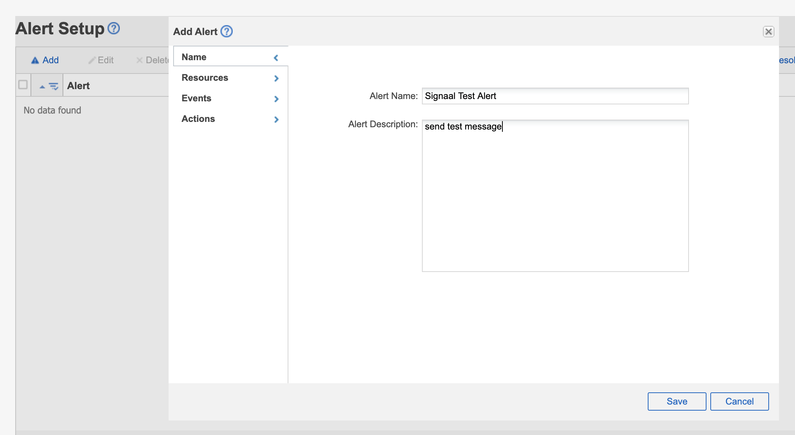
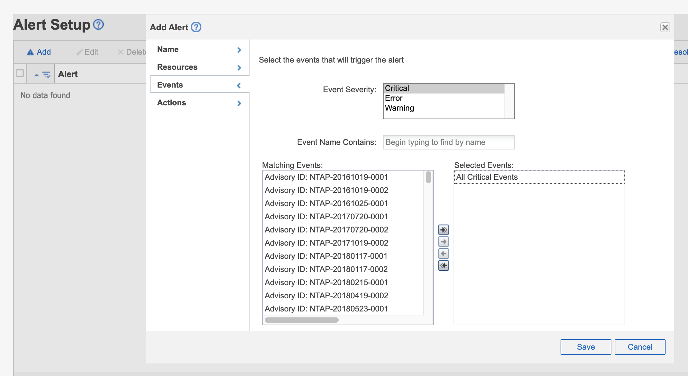
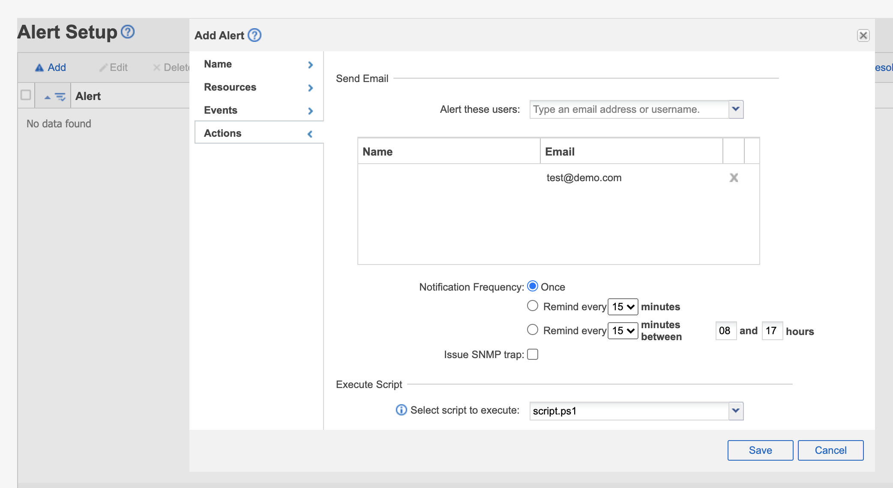
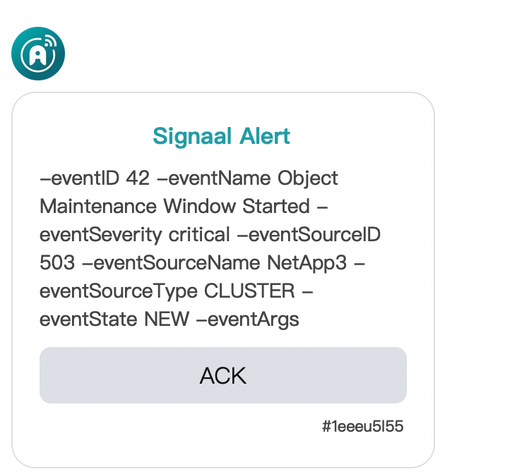

## Step0: Environmental preparation

-   Host with NetApp Active IQ installed
-   The connection between the NetApp Active IQ host and the Signalal host is smooth (the default connection port is 8000)
-   Signaal's host has a smooth external network connection

## Step1: Set up Signaal user.

-   Add user, obtain and set user ID, please refer to the user guide

## Step2: Set up the Signal group

-   Add users to the group TEST.
    

## Step3: Generate alarm script

-   Use the Script generator to generate Script, get script.ps1, please refer to the user guide-Script Generator

## Step4: Add Script to NetApp script
-   Log in to NetApp Active IQ
-   On the left → Storage Management → Script, enter the script page
    

-   New script
    

## Step4: Configure NetApp alarm settings

-   On the left → Storage Management → Alarm Setting, enter the alarm setting page
    

-   Added alert
    

-   Establish alarm conditions (take Events as an example)
    

-   Set alarm action
    

## Step5: Receive warning message

-   When an alarm is triggered, the alarm information will be received through the communication software (take the message of entering the maintenance mode as an example).
    