## Step0: 环境准备

- 已安装WhatsUp Gold之主机
- WhatsUp Gold之主机与Signaal之主机连线畅通(预设连接阜为8000)
- Signaal之主机对外网路连线畅通

## Step1: 设定Signaal使用者。

- 新增使用者，取得并设定使用者ID，请依需求参阅“发送第一封测试讯息”文件。

## Step2: 设定Signaal群组

- 将对应的使用者加入群组中。
    
     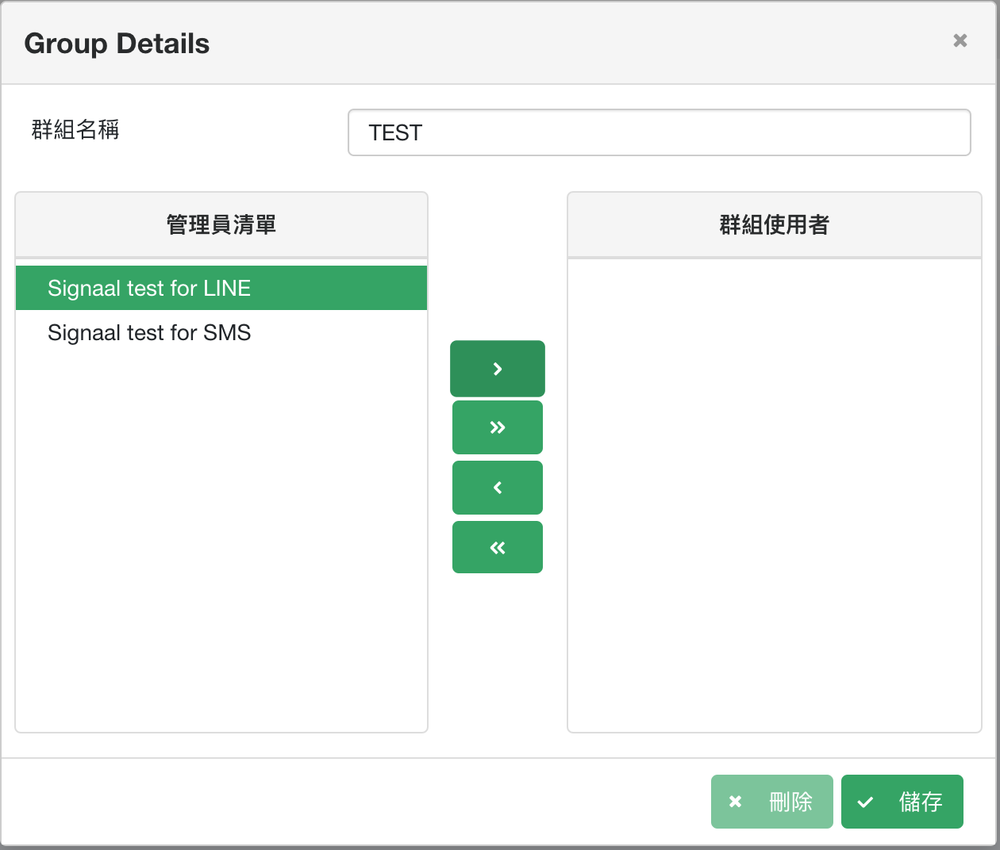
      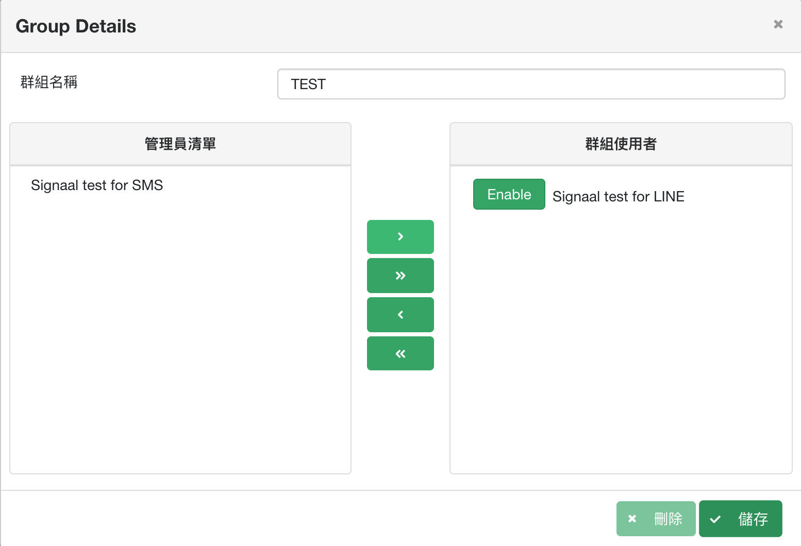

## Step3: 产生告警Script

- 使用Script产生器产生Script，复制Script并于下一步骤中使用，请参阅使用指南-Script产生器。

## Step4: 新增WhatsUp Gold动作资料库
- 进入动作与政策设定页面。
    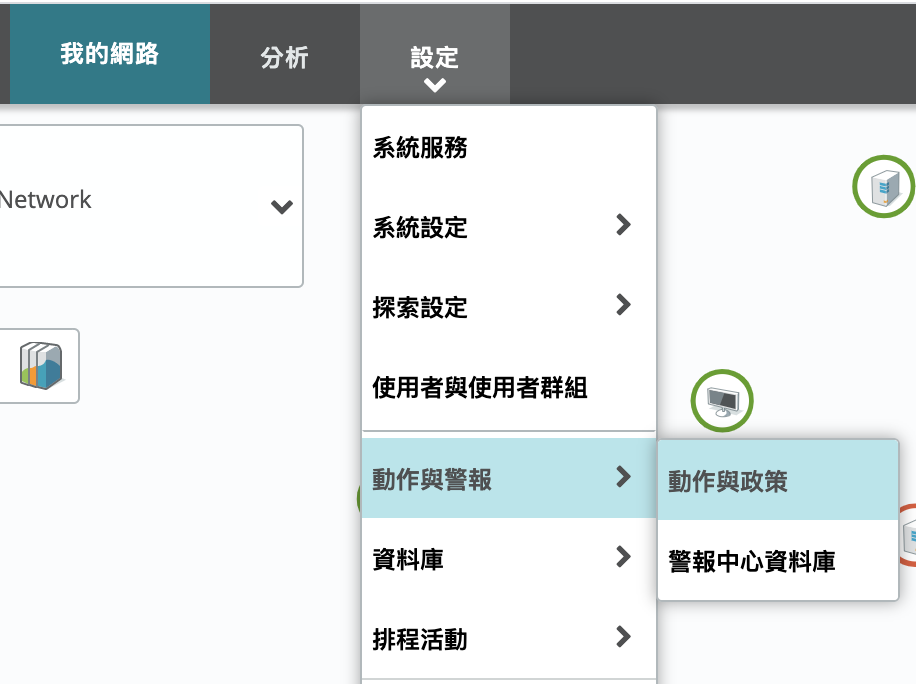

- 于下方动作资料库点选新增→动态指令码动作。
    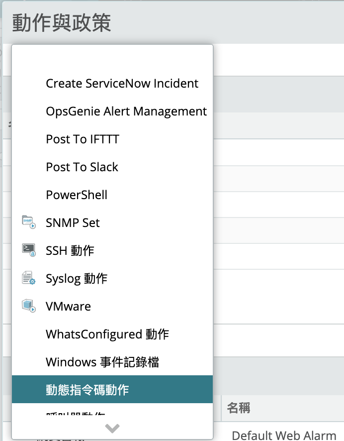

- 选择指令码类型(T): VBScript，并将上一步骤产生之Script复制至下方指令码文字(S)中。
    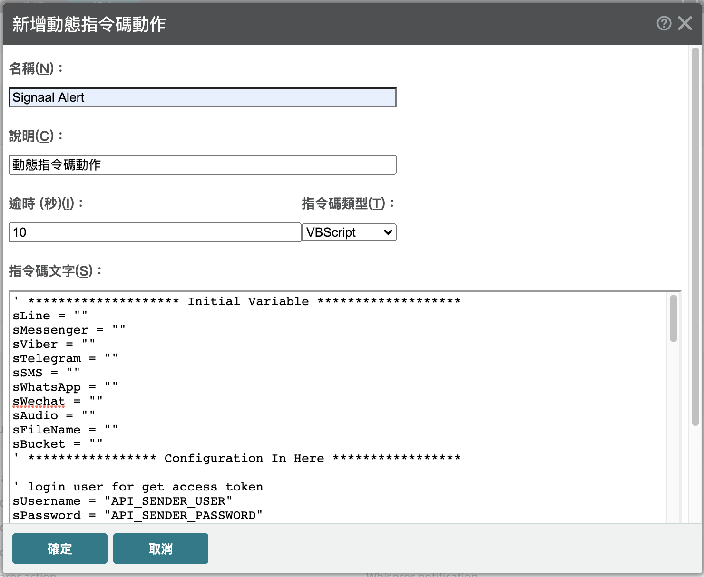

## Step5: 设定WhatsUp Gold动作政策
- 进入动作与政策设定页面。
    

- 于上方新增动作政策。
    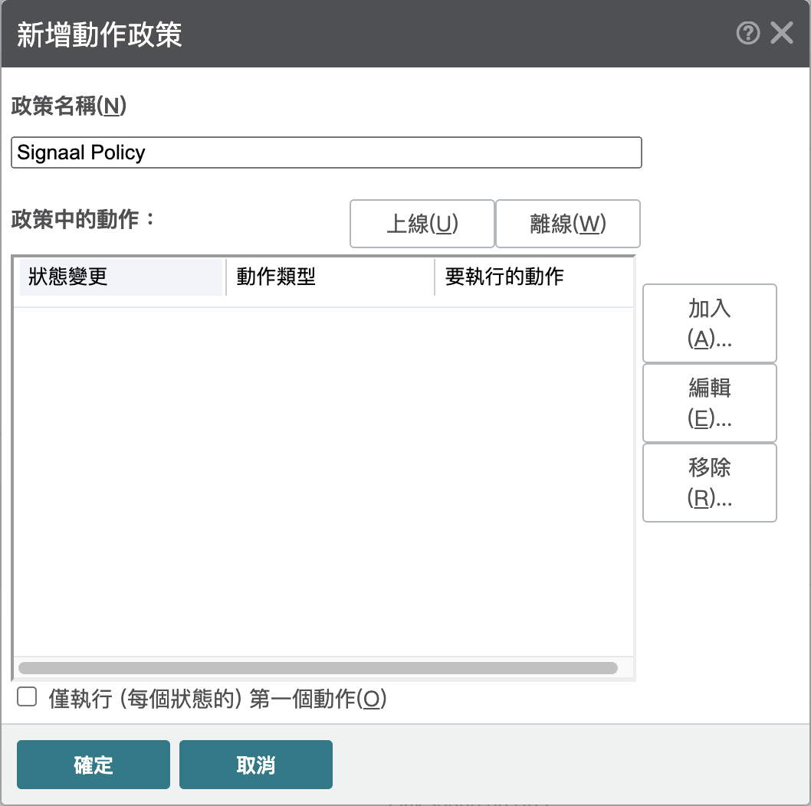

- 点击加入，并在动作资料库中选择 Signaal Alert。
    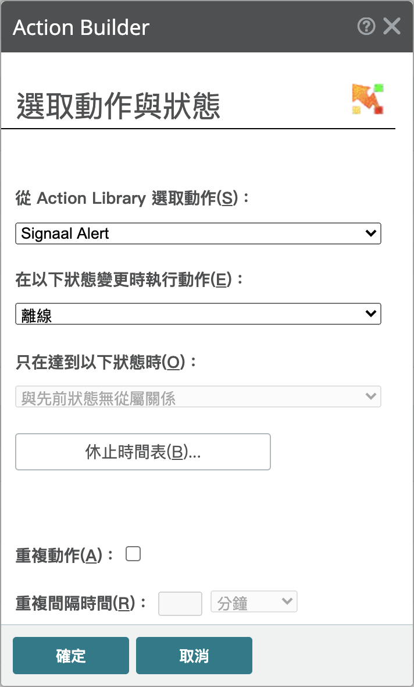

- 查看设定并点击确定。
    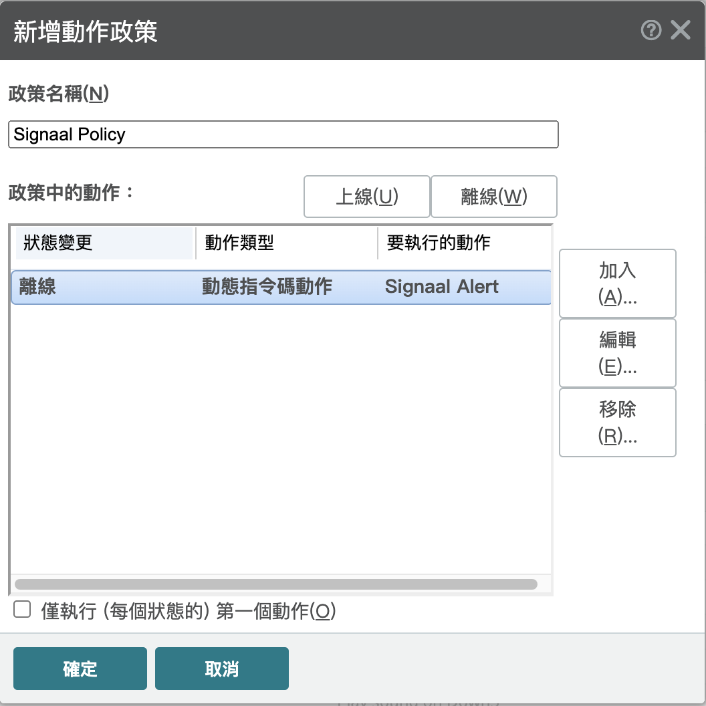

## Step6: 设定WhatsUp Gold主动监控工具

- 在需告警装置底下新增主动监控工具(以echo为例)。
    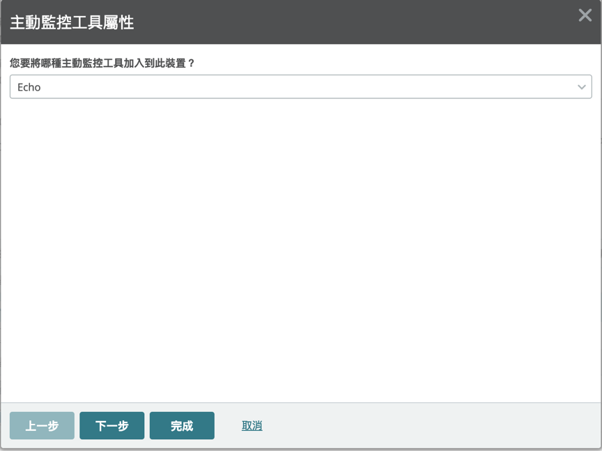

- 使用预设网路介面设定。
    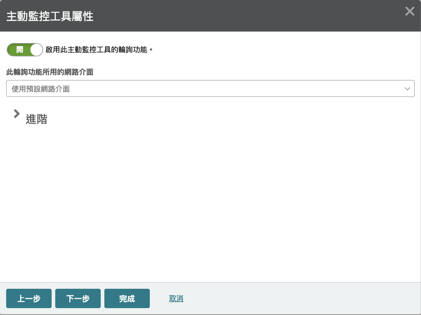

- 选择政策Signaal Policy。
    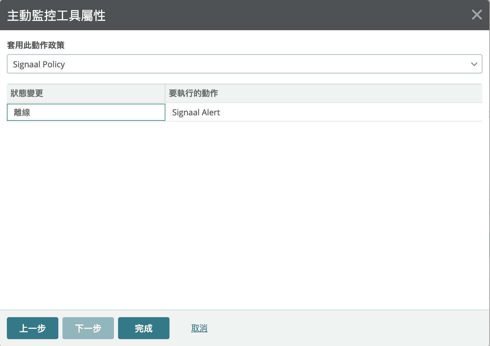

- 确认设定并按下完成。
    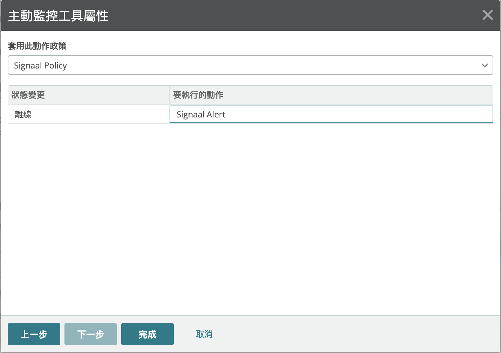

## Step7: 收到警告讯息

- 当触发告警时，便会透过通讯软体接受告警资讯。
    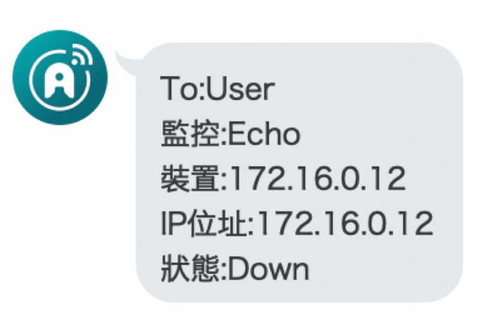