## Signaal Alert Center需求
- Mail Server需支援POP3功能。
- 全新信箱帳號。

## Signaal 設定
### Step1: 登入操作頁面
開啟Signaal Web操作頁面，並輸入帳號密碼登入。
### Step2: 設定Signaal使用者
新增使用者，取得並設定使用者ID，請參閱User Guide
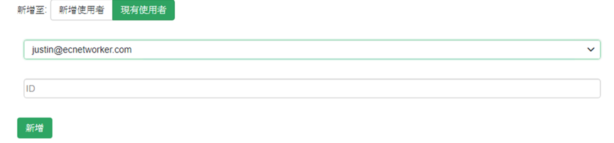
### Step3: 設定Signaal群組
將使用者加入群組group中
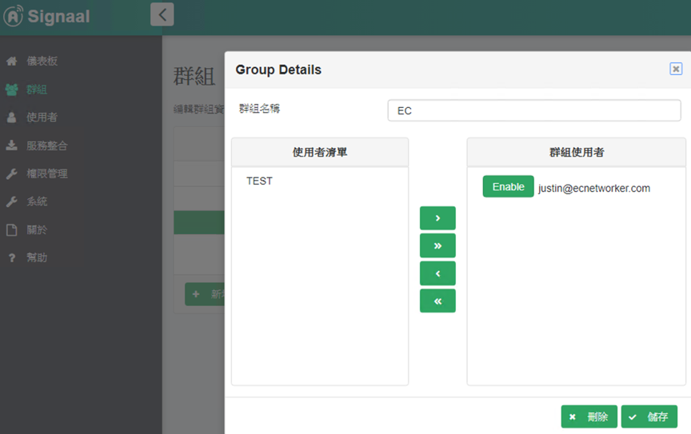
### Step4: 進入設定頁面
於左方側邊欄點擊`服務與整合`，並選擇`WUG AlertCenter`。

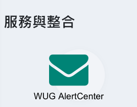
### Step5: 填寫設定資訊
輸入郵件伺服器以及通訊埠，輸入郵件帳號及密碼。

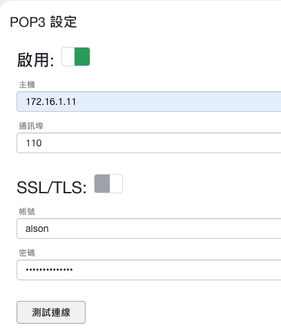
### Step6: 測試
點擊測試連線確保連線暢通
### Step7: 儲存
點擊儲存以保存設定
--------------------------------------------------
## WhatsUp Gold 設定
### Step1: 登入操作頁面
輸入WhatsUp Gold IP開啟操作頁面，並輸入帳號密碼進行登入。
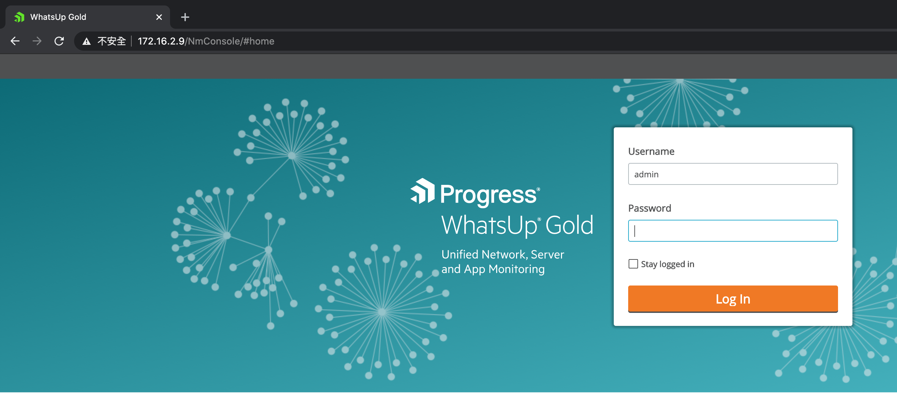
### Step2: 進入警報中心資料庫
點擊上方設定 -> 動作與警報 -> 警報中心資料庫。
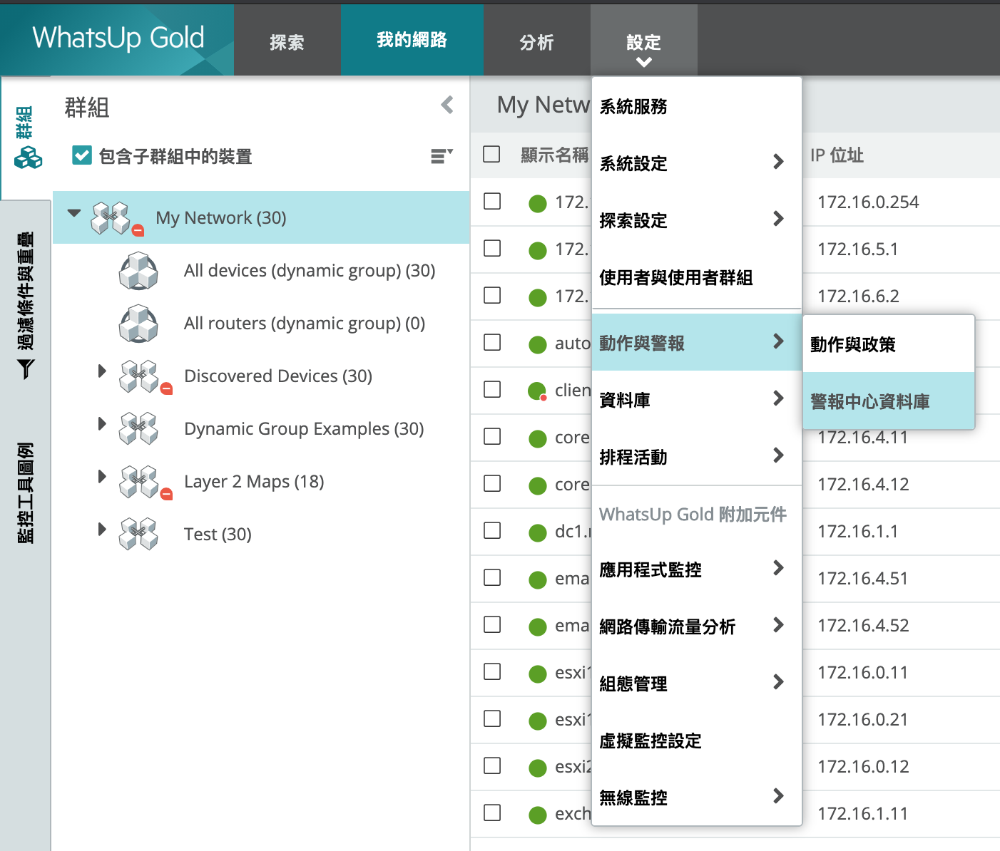
### Step3: 新增警報通知
進入通知分頁，並點選新增。

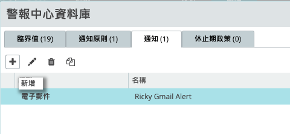
### Step4: 新增通知類型
選擇類型E-mail Action，並點選確定

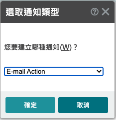
### Step4: 新增電子郵件動作
輸入名稱、SMTP伺服器、收件人與寄件人。

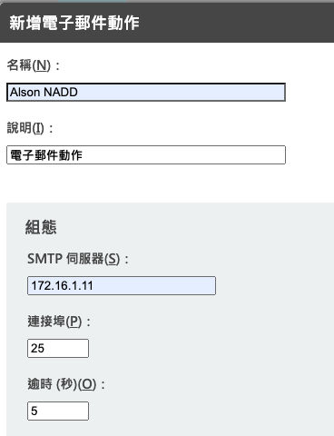

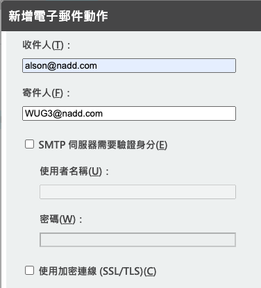

點擊下方警報中心設定值。

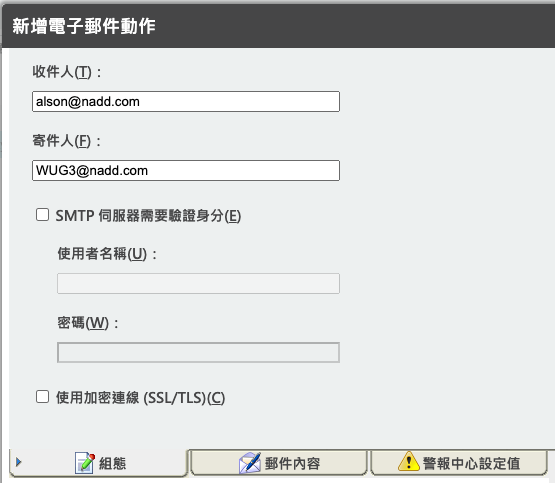

輸入主旨(請參考"請求"介紹)。

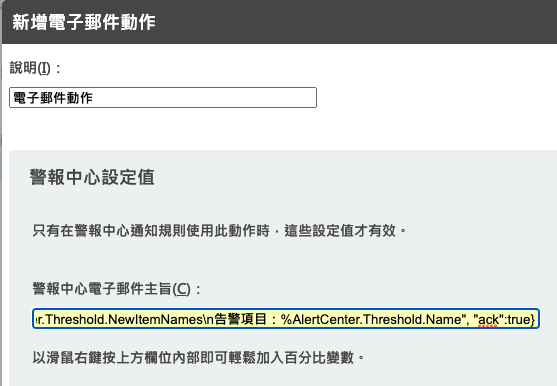

點擊確定，將設定儲存。
## 收到告警
### 接收Email告警
當設備觸發告警時，將會寄送Email至指定信箱
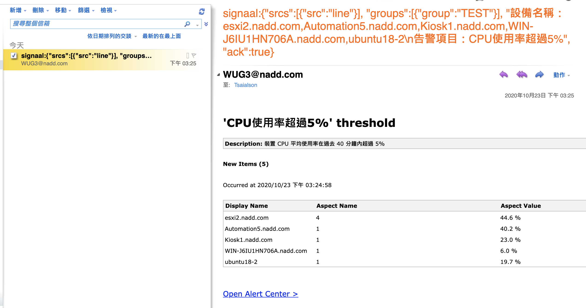
### 接收Signaal告警(以LINE為例)
於LINE上接收告警。     
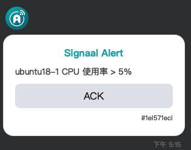

--------------------------------------------------
## Email 主旨設定
### 主旨格式
```
signaal: {
  "srcs":[{"src":"YOUR_NOTIFY_APP"}],
  "groups":[{"group":"YOUR_NOTIFY_GROUP"}],
  "content": "YOUR_NOTIFY_MESSAGE",
  "ack": true
}
```
### 範例 (以LINE為例)
發送LINE告警到group群組範例
```
signaal: {
  "srcs":[{"src":"line"}],
  "groups":[{"group":"group"}],
  "content": "Your Message",
  "ack": true
}
```

更多主旨樣板可參[請求](ug_request)
