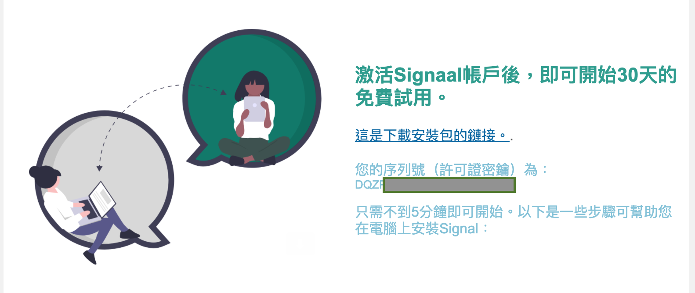
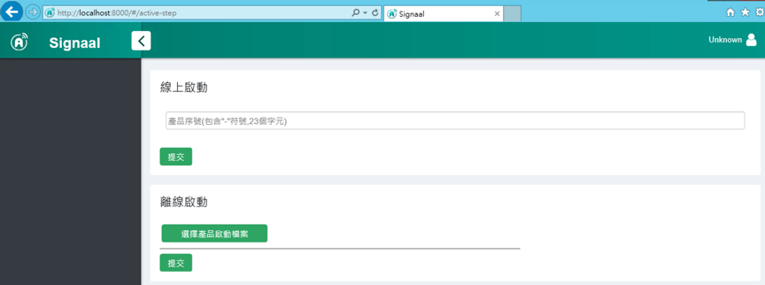
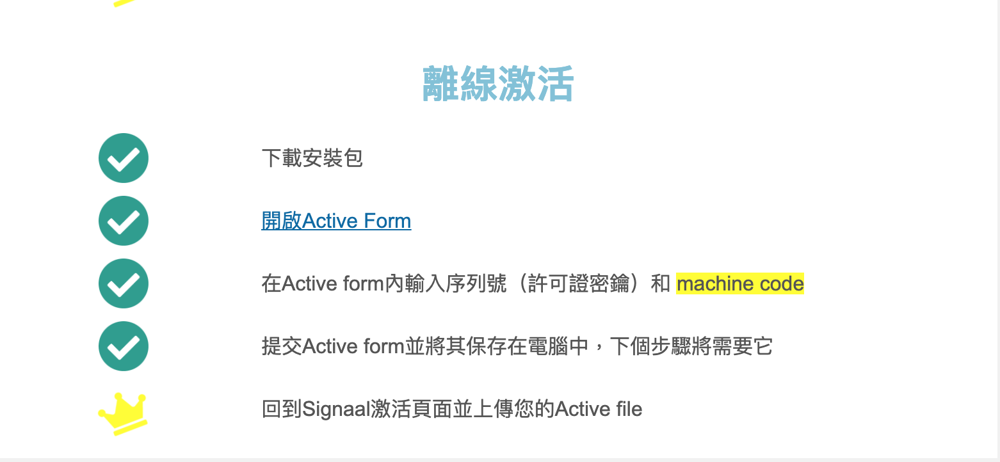
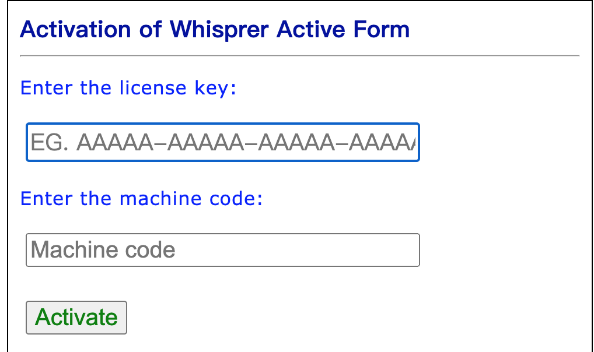
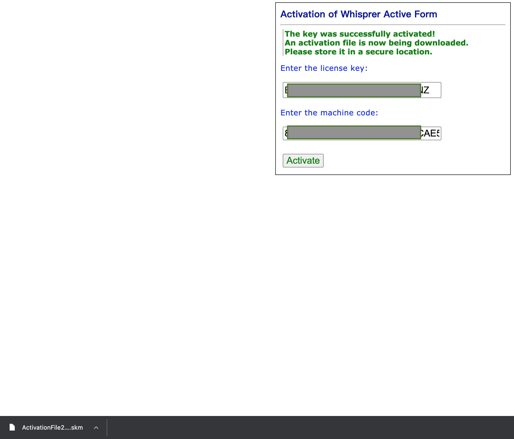
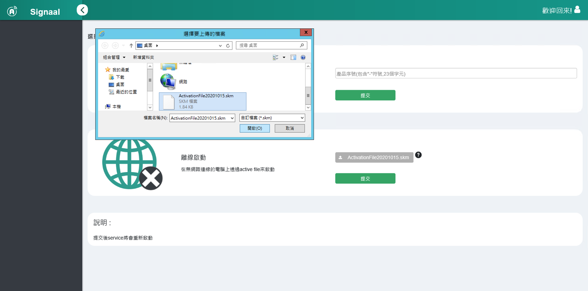
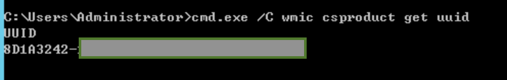

## 取得序号
申请序号后，于信箱中将会收到序号与下载连结
*

## 线上序号启动

进入启动页面(`http://localhost:8000/#/active-step`)
输入序号即可完成启动。

## 离线序号启动
于电子信箱中开启信件，并点击`开启Active Form`

在启用表单中输入license Key（许可证密钥）和 machine code

提交Active form并将其保存在电脑中，下个步骤将需要

进入启动页面(`http://localhost:8000/#/active-step`)
上传产品启用档即可完成启用。

## 取得 machine code
* machine code位于安装设备的终端机 ( 快捷键: `WIN + S`, 并输入`cmd`)
在终端机里输入: `cmd.exe /C wmic csproduct get uuid`
*