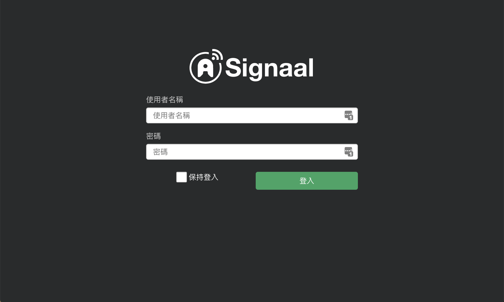
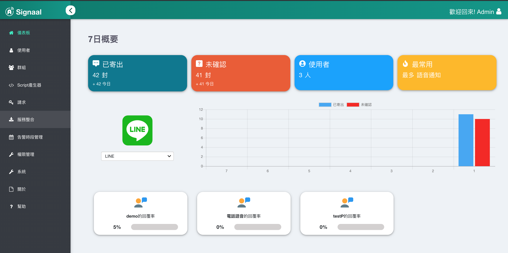
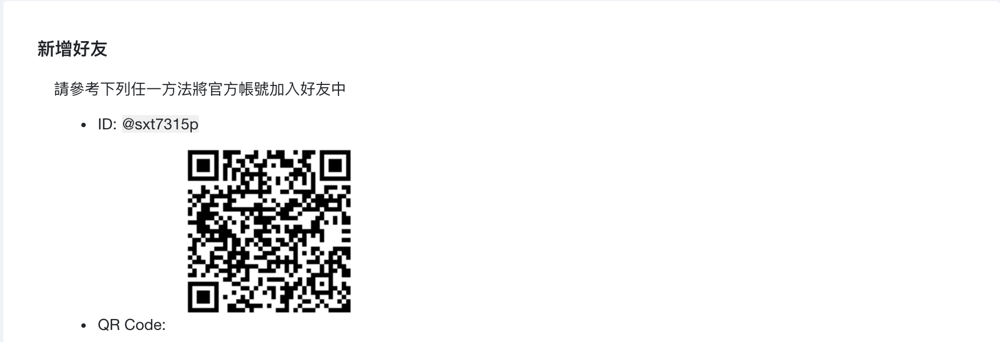
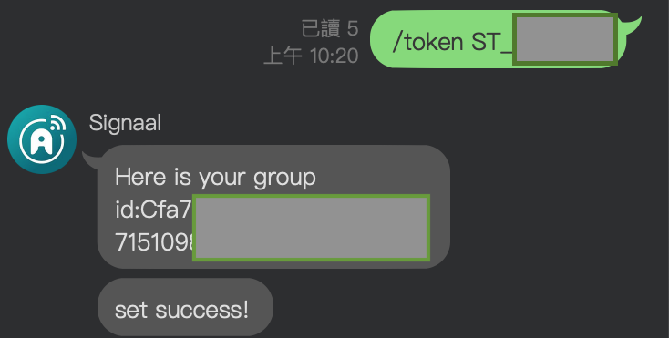
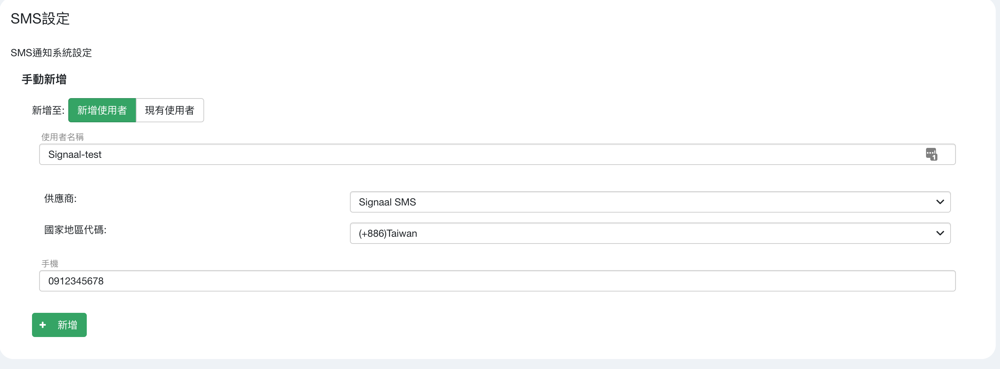
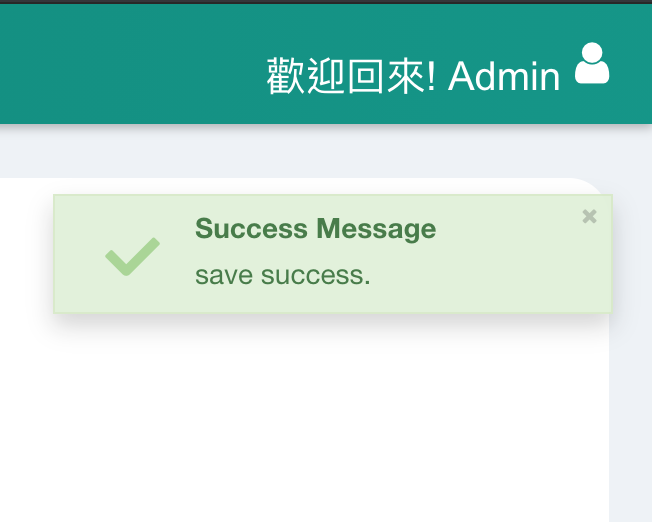
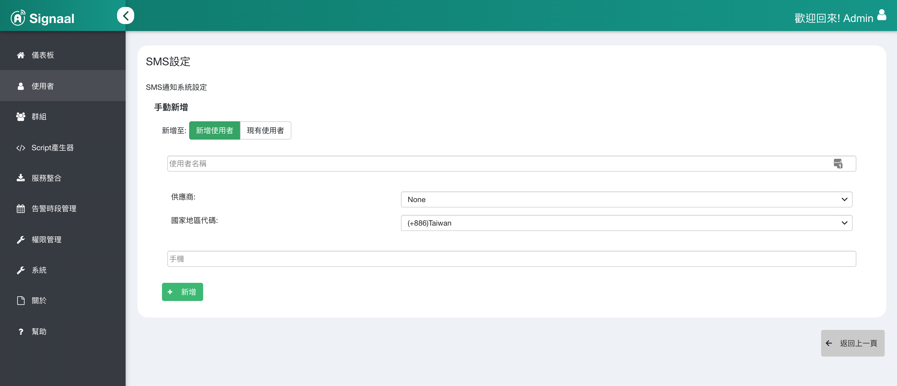
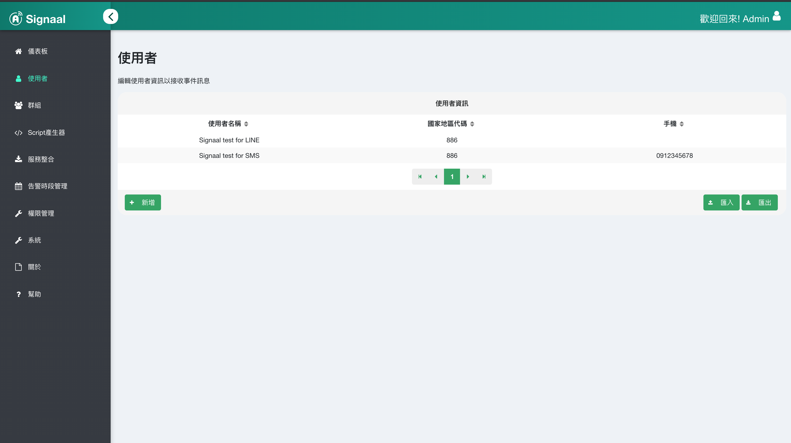
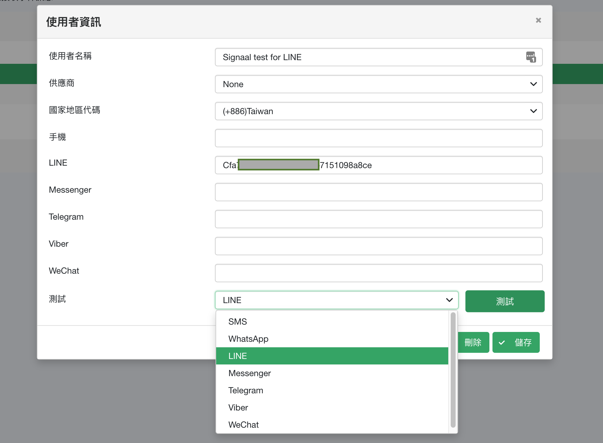
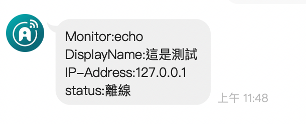

## 步驟1：以管理員身份登錄

## 步驟2：單擊左側的服務集成以查看服務項目列表

## 步驟3：選擇任何發送消息的平台
* LINE，Messenger，Telegram，Viber，WeChat跳至Step4
* WhatsApp，短信跳至Step6

## 步驟4：請參閱頁面說明以加入官方帳戶（以LINE為例）

## 步驟5：參考快速添加，輸入`/ token XXXXXX`以創建通知信息（以LINE為例）

* 步驟5.1：在官方帳戶下輸入令牌（以LINE為例）

*跳至Step7

## 步驟6：請參閱頁面說明以添加信息（以SMS為例）

* 完成後，單擊添加，並且完成通知將在右上角彈出

 
## Step7：單擊左側的用戶以查看用戶列表

## Step8：單擊您的用戶（由Step5 / Step6添加）

## 步驟9：轉到下面的測試以選擇測試發送平台（以LINE為例），然後單擊測試按鈕

## 步驟10：完成，然後檢查第一條測試消息

