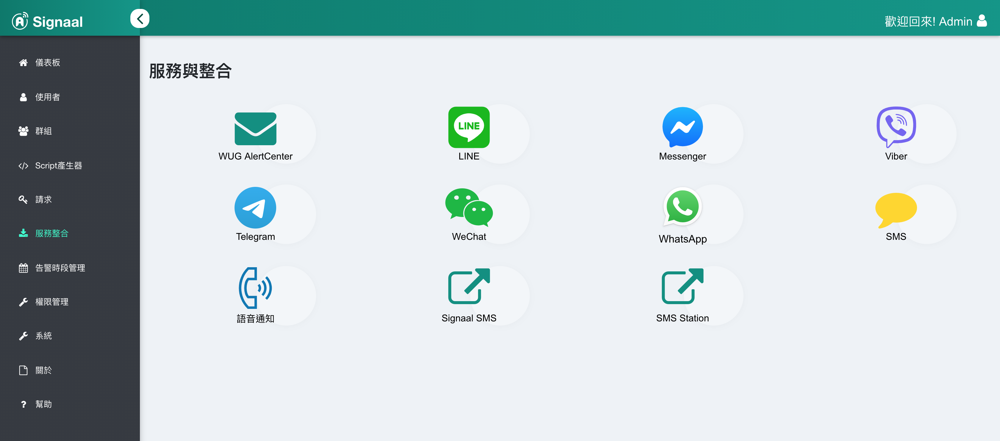
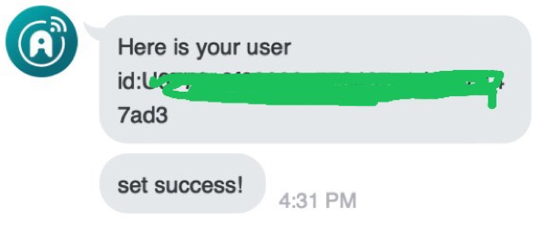

## Set up
Click on Service Integration on the left to view the list of service items

Click LINE to enter the setting page

## Get Signaal ID

In the Signaal user settings, each type of communication software requires the user to fill in information before it can be connected to the communication software, and each type of communication software has its own different link code. Enter the correct link code, and Signal can send messages. .

This article will carry out the setting operation and teach how to obtain the communication software link code and link with the communication software. The following operations need to add the corresponding Signaal bot to your friends.

### Method 1: Quick setting

Join LINE friends by
  * bot id: `@sxt7315p`
  * QR code

Please open the mobile phone communication software and enter `/token KT**VB` into the official account (Note: Check the service integration function).

The administrator can see that the User has been added on the Signal User Settings screen.

### Method 2: Manual setting

Join LINE friends by
  * bot id: `@sxt7315p`
  * QR code

Move to the official account chat window, enter: `/token` to get the LINE link code

Choose to add to a new user or an existing user, enter or select a user name, and fill in the link code in the ID field.

When finished, click Add.