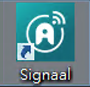

## 登入介面

-   當序號在安裝後啟用完成時，再點擊ICON即可開始使用
    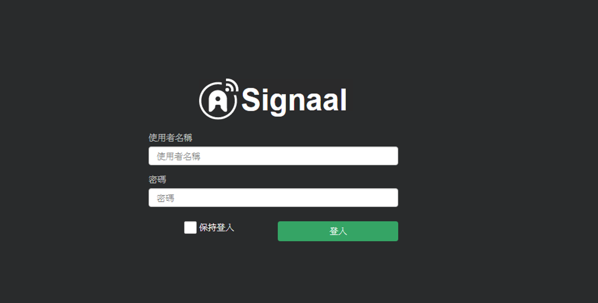
預設登入帳號密碼為admin

-   開啟選單後，登入後請點擊右上方User-\>設定，先進行密碼的更換
    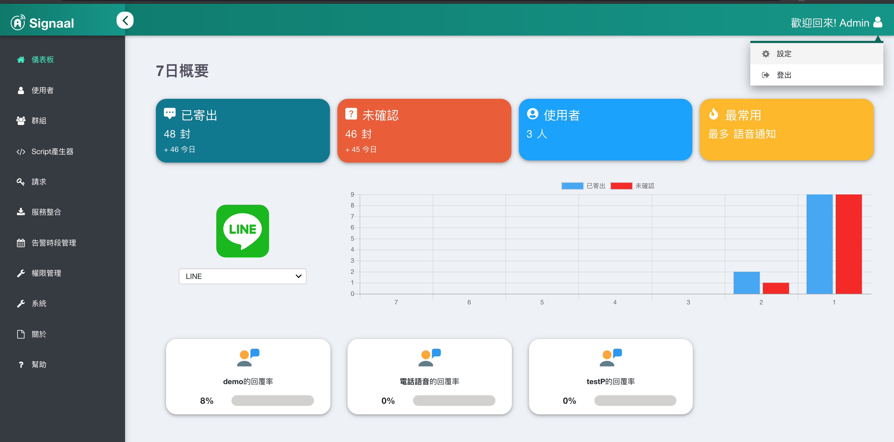

-   此頁面提供使用者顯示名稱、密碼、以及預設語言的更換
    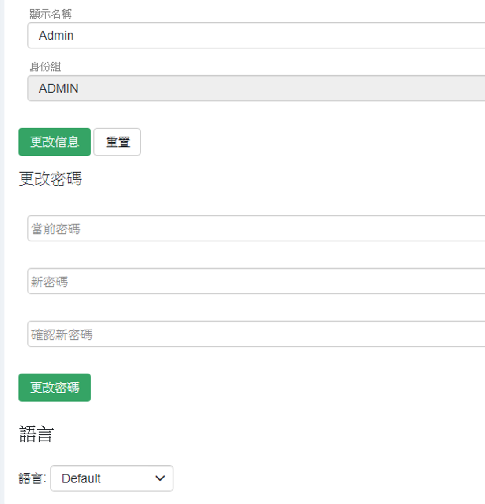
請於更換完成之後記得點選更換鍵以保存設定。

## 功能選單

-   畫面左側為所有功能選單，點選已展開選單列出所有功能項目
    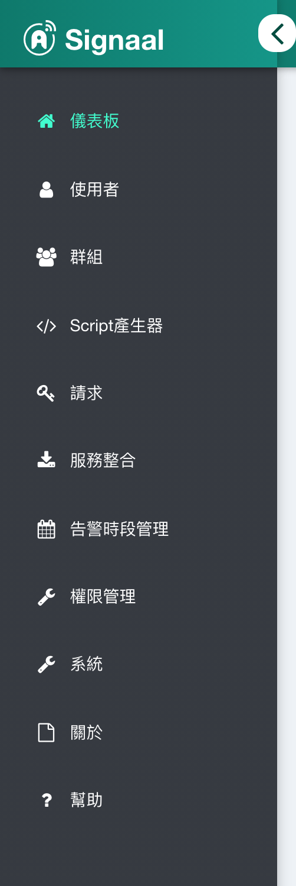

## 儀表板

-   開啟選單後點擊左方儀表板選項即可觀看儀表板，儀表板上可以檢視所有告警狀況以及ACK情形、回應率、SMS使用率與序號等等資訊。
   	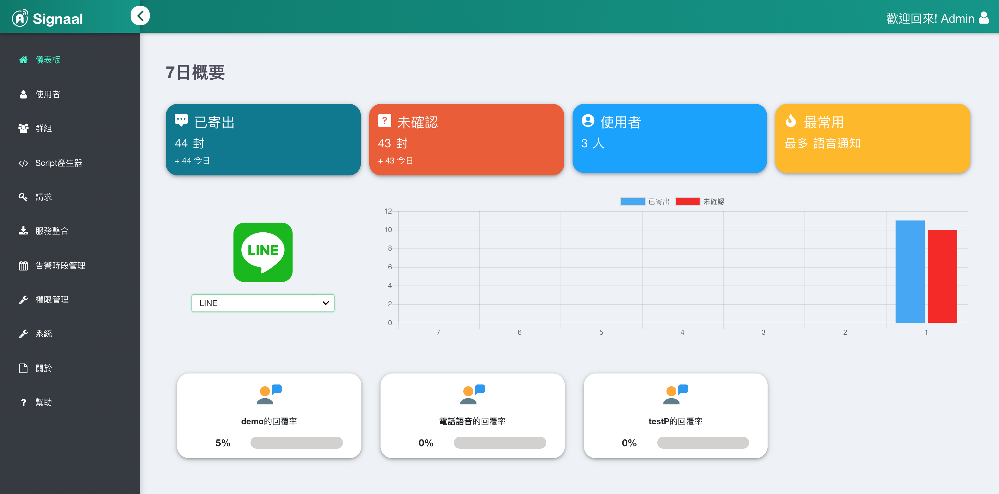
	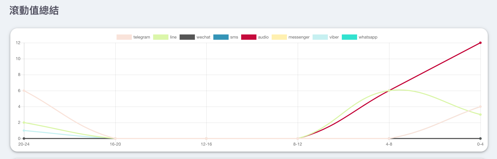
	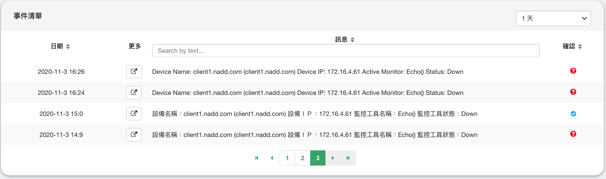
	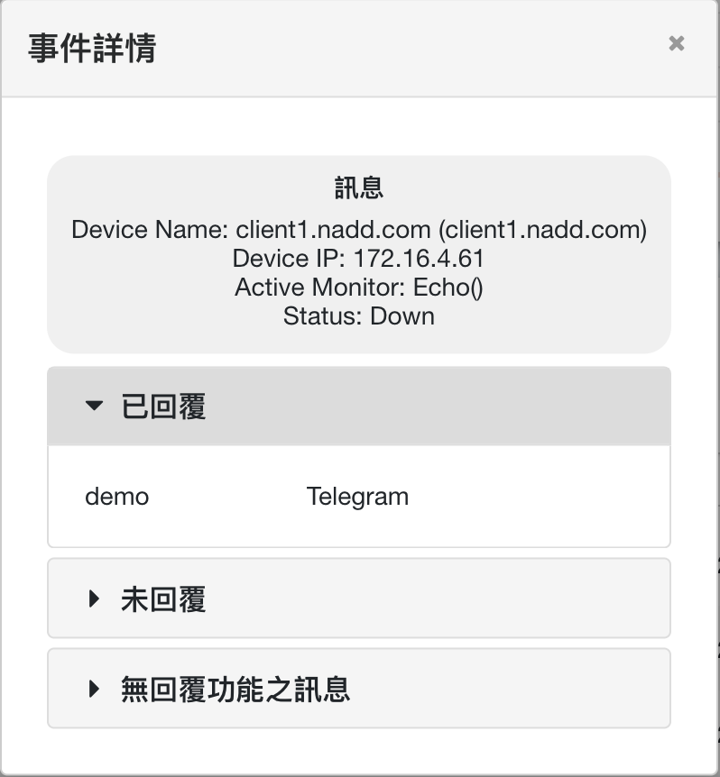
	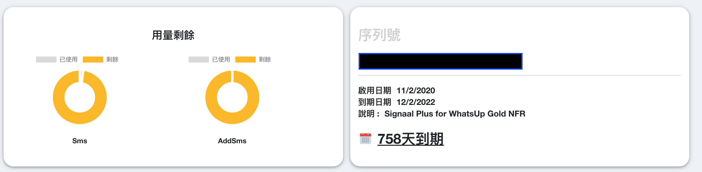

## 授權

-   開啟選單後，點擊左側關於選項即可檢視目前授權狀況，並可於其他欄位查看使用者協議，如何啟用序號以及授權更新請參考[安裝說明](install)
    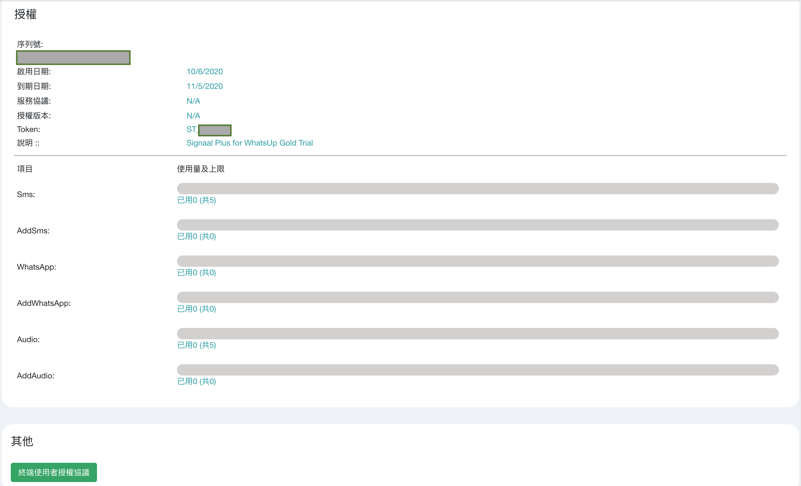

## 權限管理

-   點選權限管理即可進行signaal管理者帳號的新增/修改
    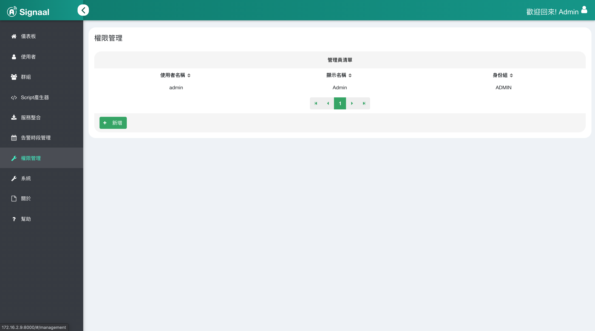

-   點擊新增可新增管理者
    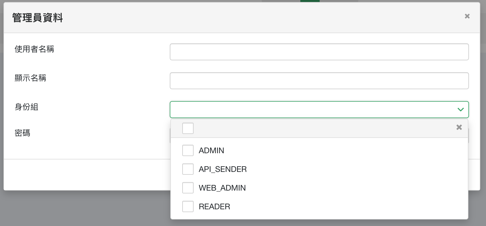

管理者分為四種類型，對應的權限為：

**ADMIN** : 擁有所有權限

**API_SENDER**: API發送者，無web權限

**WEB_ADMIN**: 擁有最高權限，但無系統權限包含：

-   重新啟動服務
-   更動日誌等級
-   更換憑證

**READER**: 僅有儀表板讀取權限

## 使用者

-   開啟選單後，點選左側使用者進行使用者編輯
    

-   點選新增按鍵以新增使用者
    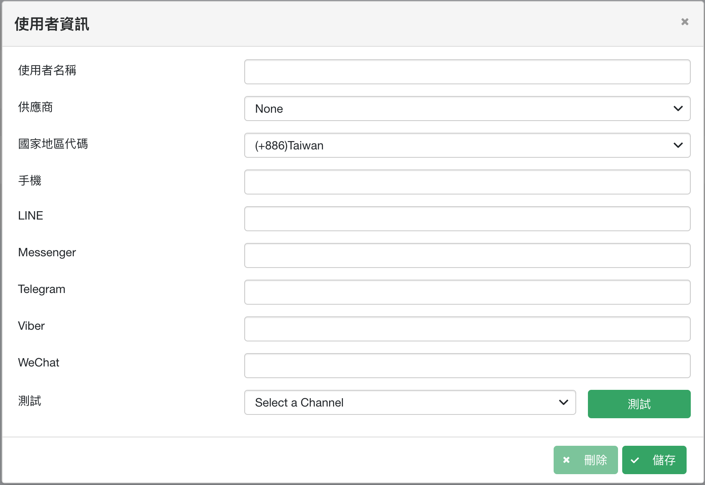
-   下方提供使用者匯入以及匯出的功能
    

-   其中以.CSV檔案格式匯入/匯出使用者內容
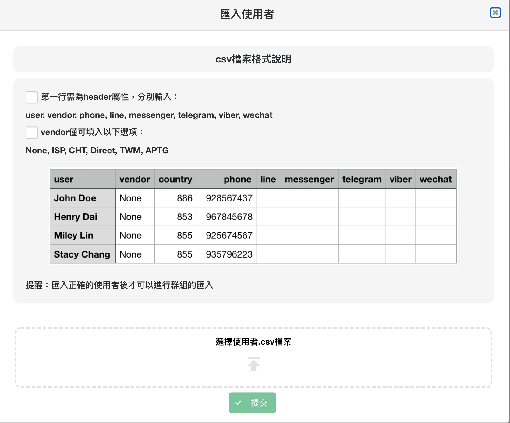

## 群組

-   開啟選單後，點擊群組更改群組設定
    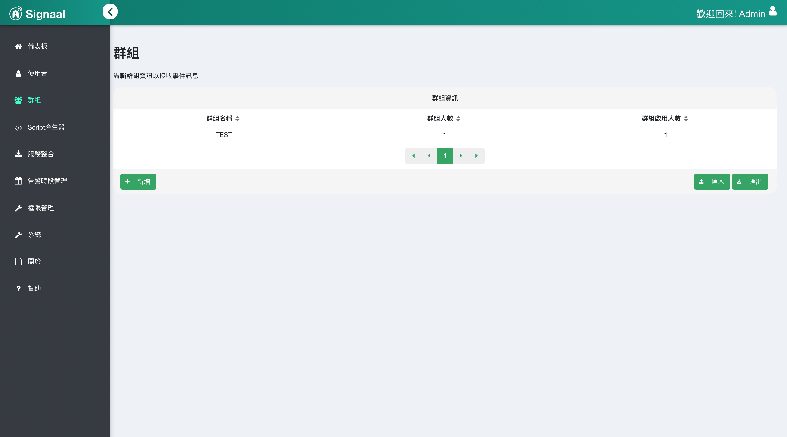

-   群組新增
    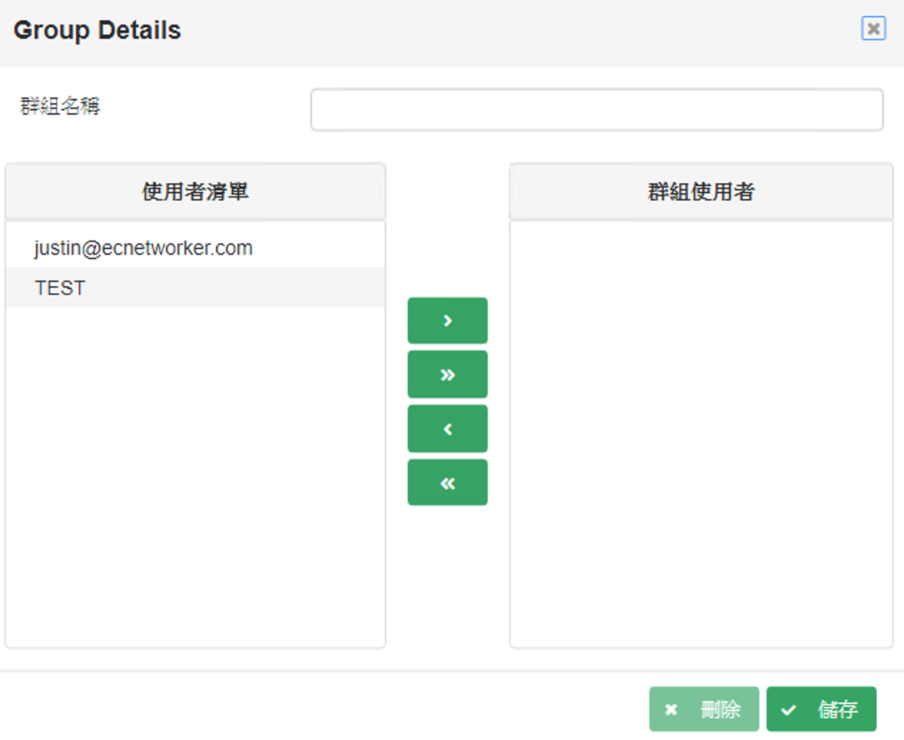

-   請在上方群組名稱輸入欲設定名稱。

-   中間提供按鍵可以新增一筆、新增多筆、移除一筆、移除多筆。

-   請於編輯完後點選儲存以保留設定。
- 下方提供群組匯入以及匯出的功能
    

-   其中以.CSV檔案格式匯入/匯出群組內容
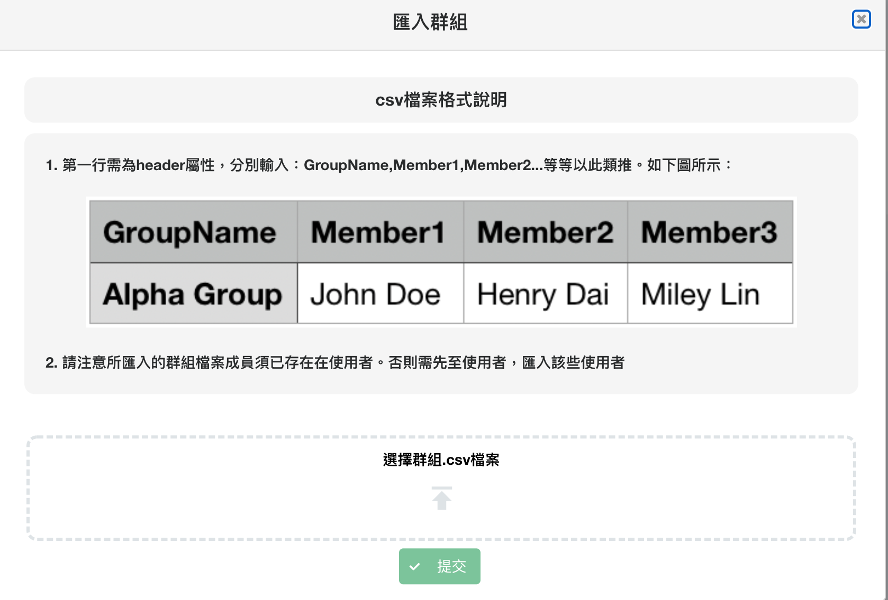

## 服務整合

-   開啟選單後，點選服務整合可以設定所有告警選項以及查看服務如何整合說明。
    

## 系統

-   開啟選單後，點擊系統可調整日誌搜集等級(Logging Level)
    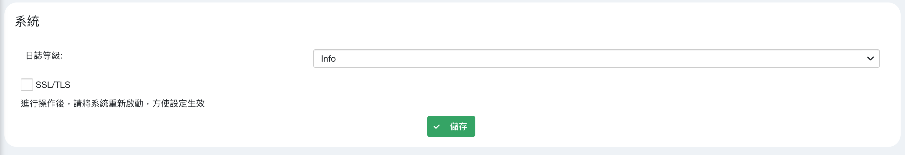

-   若有系統錯誤建議在Trouble Shooting時將日誌等級更改為Debug，請於更改完成時點擊儲存。

-   可勾選是否啟用SSL/TLS。

-   可在此匯入SSL Certificate
    

請於匯入完成時點選提交，提交完成後請重新啟動服務。

-   服務重啟
    
若進行系統變更時，可在此系統頁面執行服務的重新啟動。
