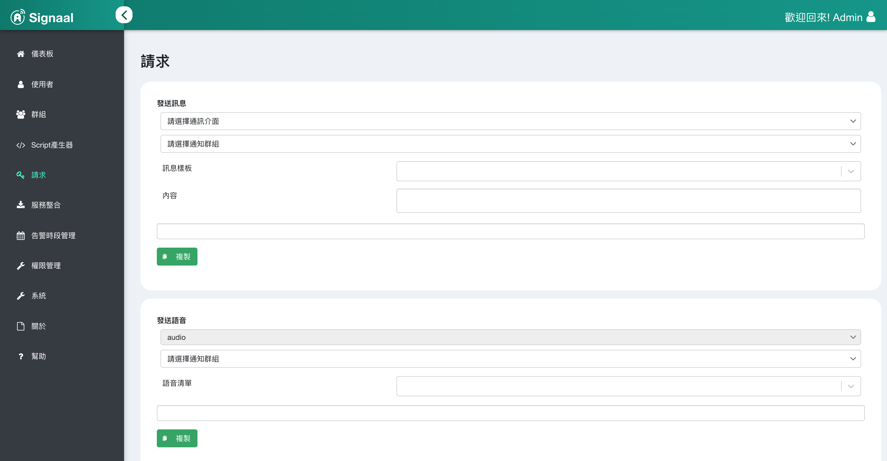
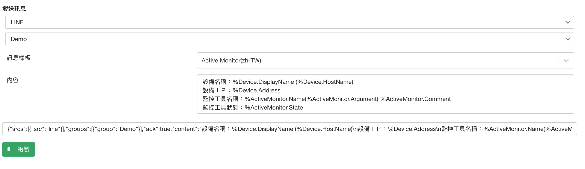
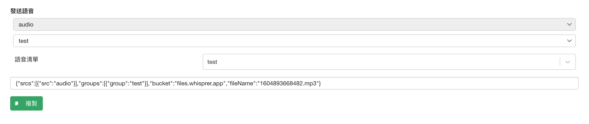

## Request generator
Click Request on the left.

## Send message
After selecting the communication interface, notification group, and message template according to your needs, the body will be automatically generated.

You can use it after clicking copy.

## Send voice
The body will be automatically generated after selecting the notification group and the voice list according to the needs.

You can use it after clicking copy.
Please refer to [Voice Notification](ug_audio) for voice file creation
