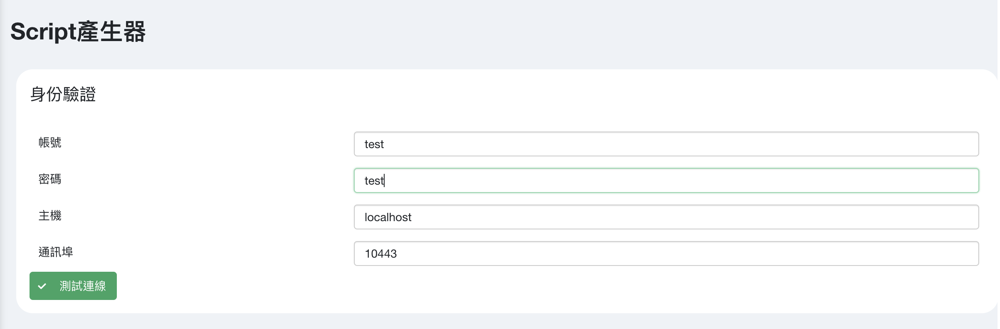
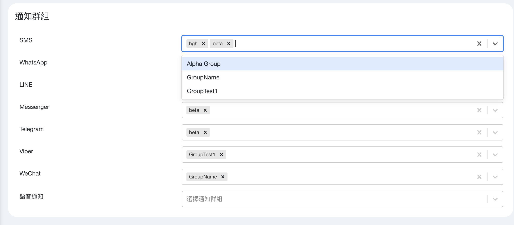
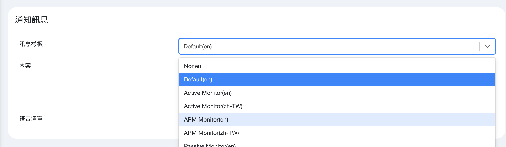
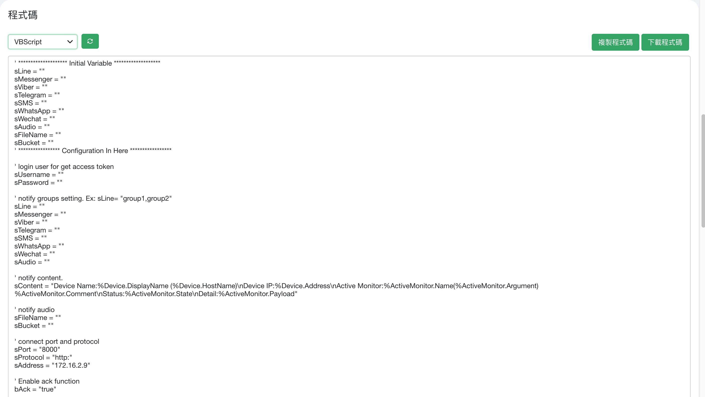

## 身份验证
### 设定连线资讯
- Signaal透过外部呼叫时，须提供一组帐号密码作为身份验证使用。
- 请另行至权限管理建立或使用现有之API_SENDER权限使用者，作为外部呼叫帐号，勿使用管理者帐号。

    

### 测试
- 输入完资讯后点击测试`连线按钮`，将于画面右方显示测试结果。

## 通知群组
- 设定接收通群组与接收讯息之通讯媒介

    

## 通知讯息
### 文字讯息
- 内建讯息样板，可以快速帮您设定讯息内容，同时也支援更改样板。
- WhatsApp讯息限制，请参考[WhatsApp-讯息模板](ug_whatsapp)

    

### 语音讯息
- 设置告警发送时，播放之语音档。
- 语音档建立请参考[语音通知](ug_audio)

## 产生程式码
- 选择欲产生程式码语言后即可取得客制化告警程式码。

    