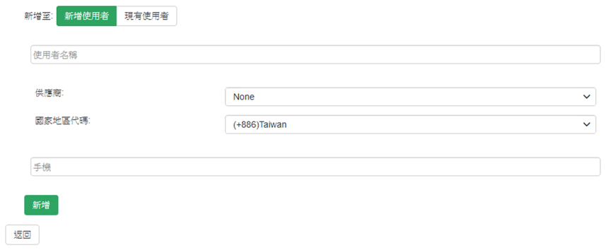

## 設定

點擊左方服務整合查看服務項目清單

點選SMS進入SMS設定頁面

將資訊新增至新使用者/現有使用者中即可完成

- 選擇簡訊供應商
  - `Default ISP SMS`: 預設簡訊供應商，需先行至各個供應商設定中指定預設
  - `Signaal SMS`: Signaal提供之簡訊服務，無需額外進行設定
  - `CHT SMS`: 中華電信簡訊服務，需至供應商設定輸入相關資訊
  - `TWM SMS`: 台灣大哥大簡訊服務，需至供應商設定輸入相關資訊
  - `APTG SMS`: 亞太電信簡訊服務，需至供應商設定輸入相關資訊
  - `SMS Station`: 使用手機做為簡訊發送平台，需至供應商設定輸入相關資訊

-   請選擇國家地區代碼，並在下方輸入手機號碼點選新增即可。
