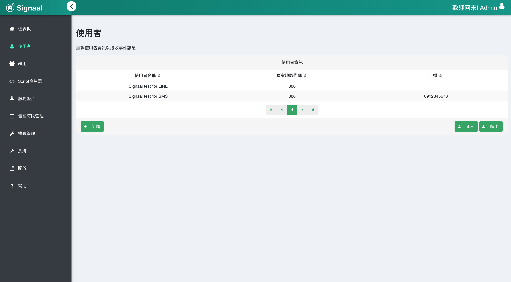
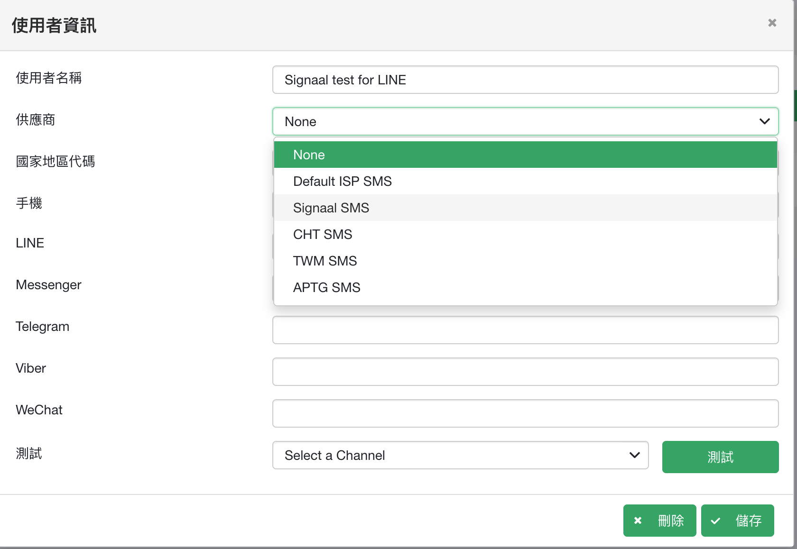
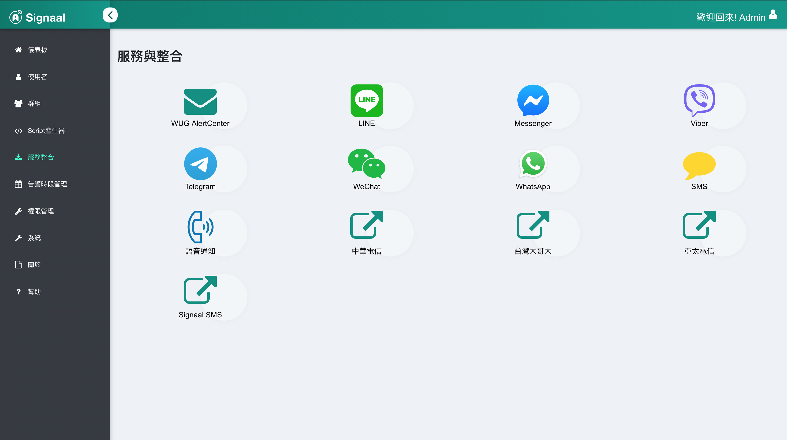
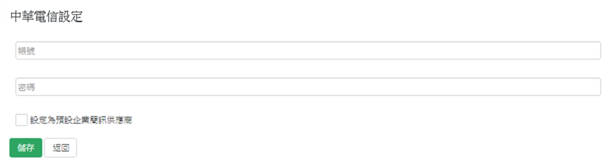
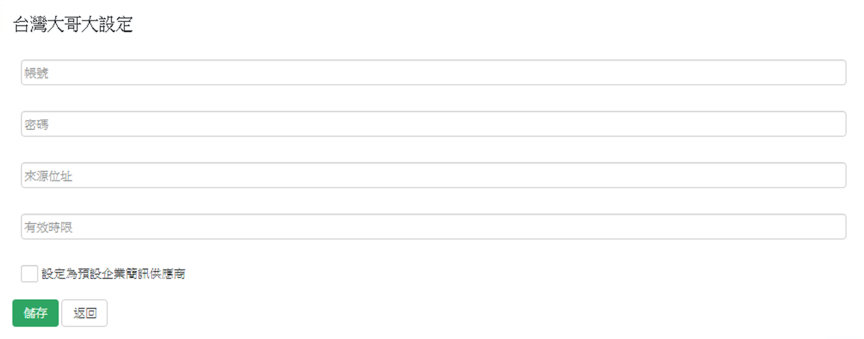
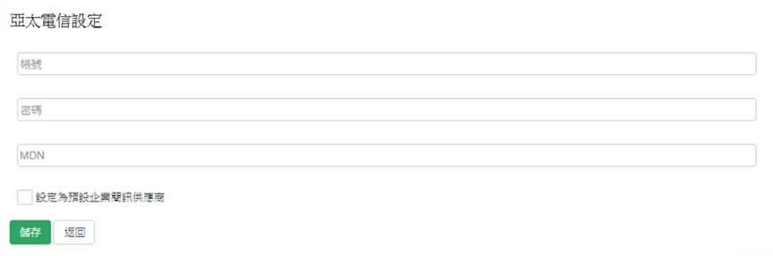

## 使用者

1. 点击左方使用者查看使用者清单

2. 点击使用者进入使用者资讯设定，并设定发送供应商

## 简讯供应商

1. 点选左侧服务整合功能，选择简讯供应商进行编辑

### 2-1. **中华电信**

帐号:`中华电信提供之帐号`
密码:`中华电信提供之密码`

### 2-2. **台湾大哥大**

简讯帐号:`台湾大哥大提供之帐号`
简讯密码:`台湾大哥大提供之密码`
来源位置:`台湾大哥大提供之来源门号`
有效时限:`300~28800`

### 2-3 **亚太电信**

简讯帐号:`亚太电信提供之帐号`
简讯密码:`亚太电信提供之密码`
MDN:`亚太电信提供之MDN`

### 2-4 **SMS Station**

主机: `手机之IP位址`
通讯埠: `手机连线之通讯埠`
SSL/TLS: `启用/关闭安全传输模式`