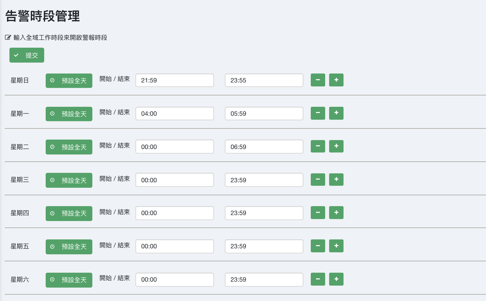
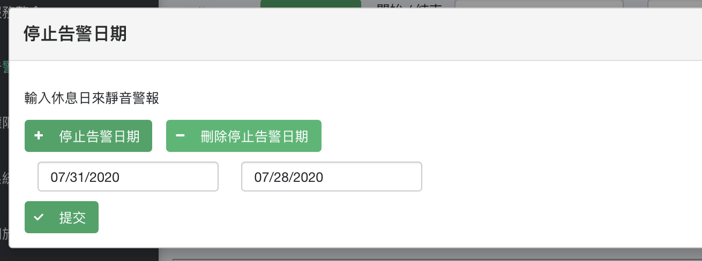
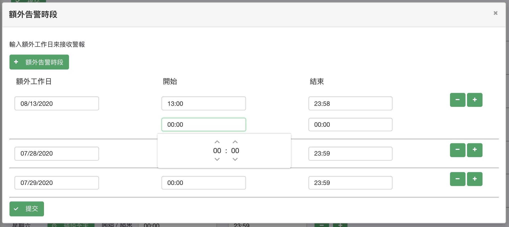

## 工作時段
- 設置每週接收告警時段，Signaal將只在您允許的時間發送告警，其餘時間將`不會`發送。
- 預設全天為24小時皆接收告警。

    

## 停止告警日
- 可設置特殊日期`不`接收告警

    

## 額外告警日
- 可設置特殊日期之時段接收告警

    

## 注意事項
- 額外告警日設置將`覆蓋`停止告警日設置
- 停止告警日設置將`覆蓋`工作時段設置

