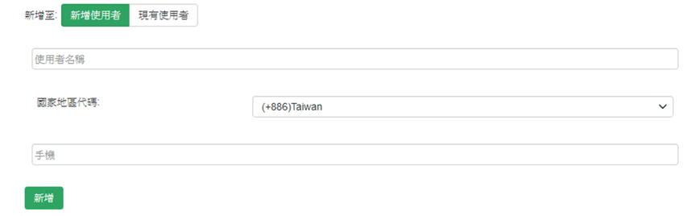

## 设定

点击左方服务整合查看服务项目清单

点击WhatsApp进入设定页面

请选择国家地区代码，并在下方输入手机号码点选新增即可。

## WhatsApp 讯息模板

基于避免系统中的垃圾讯息得推送，WhatsApp需要透过建立样板才可以对用户进行发送，若发送非样板讯息，WhatsApp将不受理该讯息。因此Signaal已先建立几种样版提供套用，如有额外需求可以[联系我们](/help)。

### 预设讯息模板
* 英文:

Monitor:%ActiveMonitor.Name\nDisplayName:%Device.DisplayName\nIP-Address:%Device.Address\nstatus:%Device.State
### 主动监控工具模板(装置)
* 英文:

Device Name: %Device.DisplayName (%Device.HostName)\nDevice IP: %Device.Address\nDevice Status: %Device.State\nDown Active Monitor: %Device.ActiveMonitorDownNames
* 中文:

设备名称：%Device.DisplayName (%Device.HostName)\n设备ＩＰ：%Device.Address\n设备状态：%Device.State\n离线监控工具：%Device.ActiveMonitorDownNames

### 主动监控工具模板(监控)
* 英文:

Device Name: %Device.DisplayName (%Device.HostName)\nDevice IP: %Device.Address\nActive Monitor: %ActiveMonitor.Name(%ActiveMonitor.Argument) %ActiveMonitor.Comment\nStatus: %ActiveMonitor.State
* 中文:

设备名称：%Device.DisplayName (%Device.HostName)\n设备ＩＰ：%Device.Address\n监控工具名称：%ActiveMonitor.Name(%ActiveMonitor.Argument) %ActiveMonitor.Comment\n监控工具状态：%ActiveMonitor .State

### 应用程式监控模组模板
* 英文:

Device Name: %Device.DisplayName (%Device.HostName)\nDevice IP: %Device.Address\nApplication: %Application.ApplicationInstance.ApplicationName\nComponent: %Application.TriggeringComponent.Name\nStatus: %Application.TriggeringComponent.CurrentState\nValue : %Application.TriggeringComponent.CurrentValue\nThreshold: %Application.TriggeringComponent.ThresholdConfiguration
* 中文:

设备名称：%Device.DisplayName (%Device.HostName)\n设备ＩＰ：%Device.Address\n应用程式：%Application.ApplicationInstance.ApplicationName\n元件名称：%Application.TriggeringComponent.Name\n元件状态：% Application.TriggeringComponent.CurrentState\n现在轮询值：%Application.TriggeringComponent.CurrentValue\n临界值设定：%Application.TriggeringComponent.ThresholdConfiguration

### 被动监控工具模板
* 英文:

Device Name: %Device.DisplayName (%Device.HostName)\nDevice IP: %Device.Address\nEvent Name: %PassiveMonitor.DisplayName
* 中文:

设备名称：%Device.DisplayName (%Device.HostName)\n设备ＩＰ：%Device.Address\n事件名称：%PassiveMonitor.DisplayName

### 效能监控工具模板
* 英文:

Device Name: %AlertCenter.Threshold.NewItemNames\nThreshold: %AlertCenter.Threshold.Name
* 中文:

设备名称：%AlertCenter.Threshold.NewItemNames\n告警项目：%AlertCenter.Threshold.Name