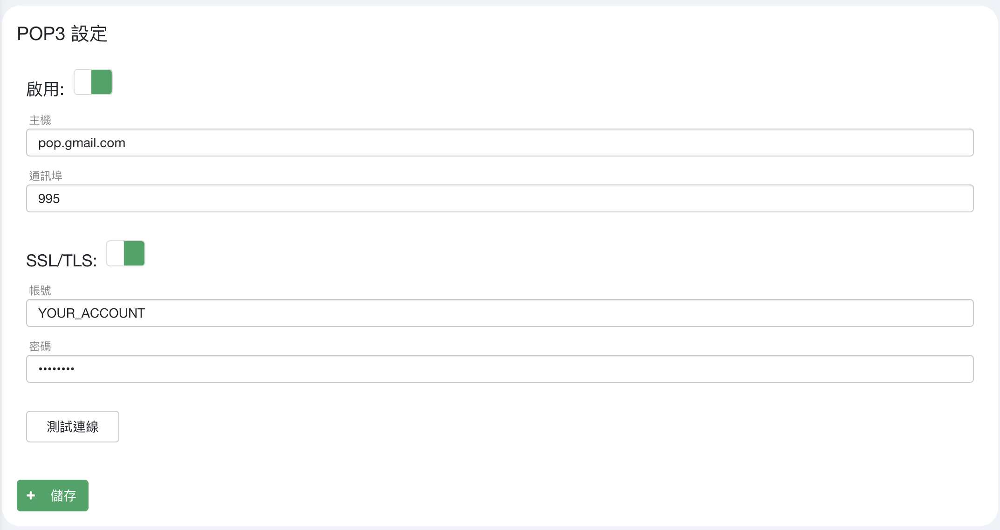

## 準備
1. 可啟用POP3服務之Mail Server乙台
2. 已開啟POP3服務之"全新"帳號

## 設定
點擊左方服務整合查看服務項目清單 -> WUG AlertCenter進入設定頁面。


將POP3設定切換為啟用，並輸入連線資訊(以gmail為例)，並依需求確認是否開啟SSL/TLS功能。


點擊測試連線確保連線暢通，並儲存設定即可

## 文字訊息格式
Signaal 將Email轉換成通訊軟體告警時，使用Email主旨(Subject)作為依據產生相應的通知發送，格式如下：
```
signaal:{
  "srcs": [{"src": "YOU_WANT_TO_RECEIVE_APP"}...],
  "groups": [{"group": "YOUR_GROUP_NAME"}...],
  "content": "YOUR_MESSAGE"
}
```
* `YOU_WANT_TO_RECEIVE_APP`: 欲發送訊息之平台。可為:`sms`/`whatsapp`/`line`/`messenger`/`viber`/`telegram`/`wechat`
* `YOUR_GROUP_NAME`: 欲通知群組
* `YOUR_MESSAGE`: 訊息內容，支援[WhatsUp Gold 百分比變數](https://docs.ipswitch.com/NM/WhatsUpGold2019/03_Help/1033/index.htm?42503.htm?toc.htm)

同時發送LINE與Telegram至群組test_group之範例：

```
signaal:{
  "srcs": [{"src": "line"}, {"src": "telegram"}],
  "groups": [{"group": "test_group"}],
  "content": "%AlertCenter.Threshold.NewItemNames %AlertCenter.Threshold.Name"
}
```

## 語音訊息格式
Signaal 將Email轉換成語音告警時，使用Email主旨(Subject)作為依據產生相應的通知發送，格式如下：

```
signaal:{
  "srcs": [{"src": "audio"}],
  "groups": [{"group": "YOUR_GROUP_NAME"}...],
  "bucket": "YOUR_BUCKET",
  "fileName": "YOUR_FILE_NAME"
}
```
* `YOUR_GROUP_NAME`: 欲通知群組
* `YOUR_BUCKET`: 欲傳送語音之儲存桶名稱，可於服務整合->語音通知中查看
* `YOUR_FILE_NAME`: 欲傳送語音之檔案名稱，可於服務整合->語音通知中查看


發送語音通知至群組test_group之範例：

```
signaal:{
  "srcs": [{"src": "audio"}],
  "groups": [{"group": "test_group"}],
  "bucket": "bucket",
  "fileName": "example.mp3"
}
```

更多訊息格式請參考[請求](ug_request)
